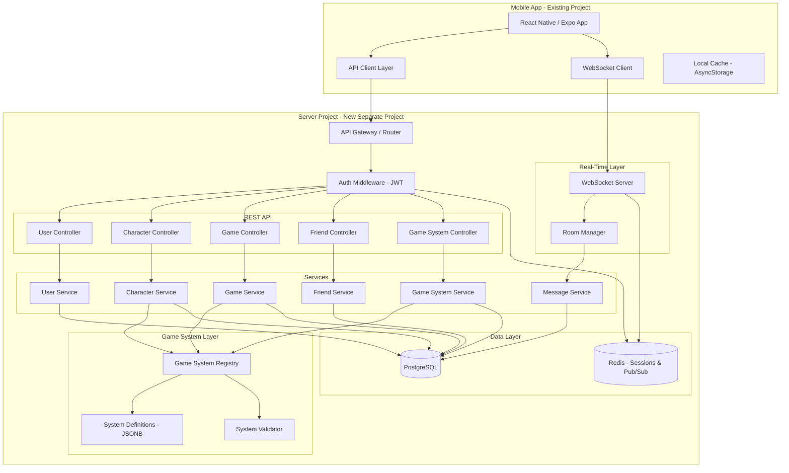
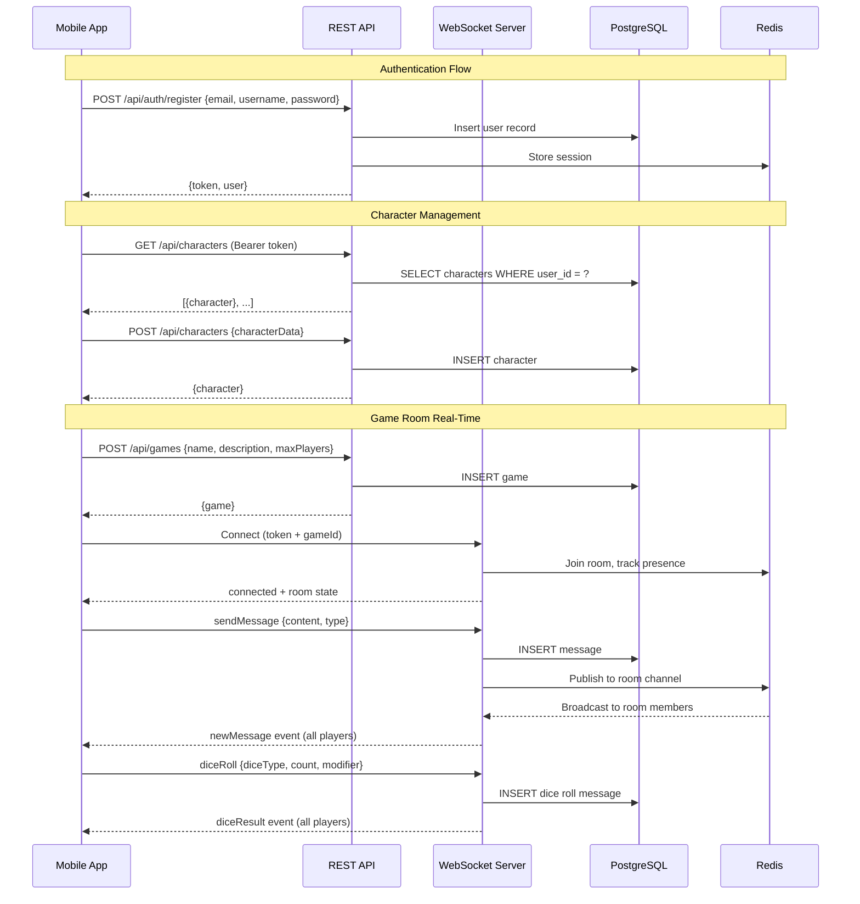
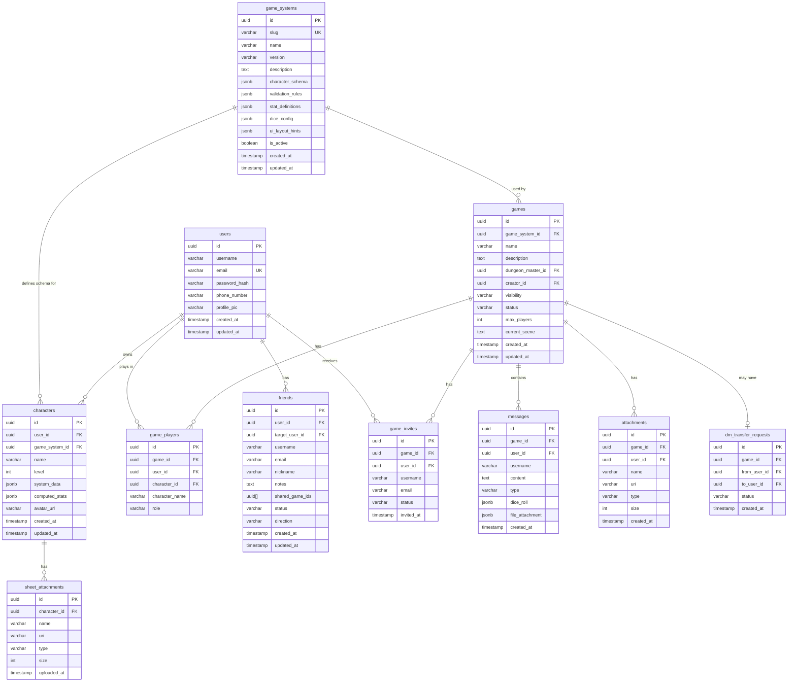

# Design Document: Server-Side Setup

## Overview

This document defines the architecture for a standalone server project that provides the backend API for the Fantasy RPG Companion mobile app. The mobile app currently stores all data locally via AsyncStorage and SQLite. The server will centralize data persistence, enable real-time multiplayer across devices, and handle authentication — while keeping the mobile and server codebases completely separate to avoid dependency conflicts and project bloat.

The server exposes a RESTful API for CRUD operations and a WebSocket layer for real-time game room features (chat, dice rolls, scene updates). The mobile app will communicate with the server over HTTPS and WSS, replacing local repository calls with API client calls. Local storage will transition to an offline cache that syncs with the server.

The server is designed as a standalone Node.js project with its own repository, dependencies, and deployment pipeline — fully decoupled from the Expo/React Native mobile project.

### Multi-System TTRPG Scalability

The architecture is designed to be game-system agnostic from day one. Rather than hardcoding D&D-specific data structures, the server uses a plugin-based game system registry that allows any tabletop RPG system (D&D 5e, Pathfinder 2e, Call of Cthulhu, Shadowrun, FATE, etc.) to be supported without database migrations or code restructuring. Character sheets, validation rules, stat definitions, and dice mechanics are all driven by per-system configuration stored as flexible JSONB schemas. New game systems can be added by registering a system definition — no schema changes required.

## Architecture



## Communication Flow



## Components and Interfaces

### Component 1: Auth Middleware

**Purpose**: Handles user registration, login, and JWT token validation for all protected routes.

**Interface**:

```pascal
INTERFACE AuthMiddleware
  register(email, username, password, phoneNumber) -> {token, user}
  login(email, password) -> {token, user}
  validateToken(token) -> {userId, username}
  refreshToken(token) -> {newToken}
  logout(token) -> void
END INTERFACE
```

**Responsibilities**:

- Password hashing with bcrypt
- JWT token generation and validation
- Session tracking via Redis
- Rate limiting on auth endpoints

### Component 2: User Controller

**Purpose**: Manages user profile CRUD operations.

**Interface**:

```pascal
INTERFACE UserController
  GET    /api/users/me              -> User
  PUT    /api/users/me              -> User
  DELETE /api/users/me              -> void
  GET    /api/users/:id             -> PublicUser
  GET    /api/users/search?q=       -> PublicUser[]
END INTERFACE
```

**Responsibilities**:

- Profile retrieval and updates
- User search for friend/game invitations
- Account deletion with cascade cleanup

### Component 3: Character Controller

**Purpose**: Full CRUD for character sheets across any supported TTRPG system, scoped to the authenticated user. Character data is stored as flexible JSONB, validated against the game system's schema.

**Interface**:

```pascal
INTERFACE CharacterController
  GET    /api/characters                        -> Character[]
  GET    /api/characters?game_system_id=:sysId  -> Character[]  // filter by system
  GET    /api/characters/:id                    -> Character
  POST   /api/characters                        -> Character    // body includes game_system_id
  PUT    /api/characters/:id                    -> Character
  DELETE /api/characters/:id                    -> void
  POST   /api/characters/:id/import             -> Character    // PDF import
  POST   /api/characters/:id/validate           -> ValidationResult  // validate against system schema
END INTERFACE
```

**Responsibilities**:

- Character CRUD scoped to authenticated user
- Validation of character data against the game system's registered schema (not hardcoded rules)
- PDF character sheet import endpoint (system-aware parsing)
- Attachment management for character sheets
- Reject characters referencing an unsupported or inactive game system

### Component 4: Game Controller

**Purpose**: Manages game/campaign lifecycle, player membership, and invitations. Each game is associated with a specific game system.

**Interface**:

```pascal
INTERFACE GameController
  GET    /api/games                  -> Game[]       // user's games
  GET    /api/games/browse           -> Game[]       // public + friends_only
  GET    /api/games/browse?game_system_id=:sysId -> Game[]  // filter by system
  GET    /api/games/:id              -> Game
  POST   /api/games                  -> Game         // body includes game_system_id
  PUT    /api/games/:id              -> Game
  DELETE /api/games/:id              -> void
  POST   /api/games/:id/join         -> Game
  POST   /api/games/:id/leave        -> Game
  POST   /api/games/:id/invite       -> GameInvite
  PUT    /api/games/:id/invite/:uid  -> GameInvite   // accept/decline
  POST   /api/games/:id/dm-transfer  -> DmTransferRequest
END INTERFACE
```

**Responsibilities**:

- Game creation with DM assignment and game system selection
- Player join/leave with max player enforcement
- Enforce that characters assigned to a game match the game's system
- Invitation system (pending/accepted/declined)
- DM transfer workflow
- Visibility filtering (public, friends_only, private)

### Component 5: Game System Controller

**Purpose**: Manages the game system registry — listing available systems, retrieving system schemas, and (for admins) registering new systems.

**Interface**:

```pascal
INTERFACE GameSystemController
  GET    /api/game-systems                -> GameSystem[]       // list all active systems
  GET    /api/game-systems/:id            -> GameSystem         // full system definition
  GET    /api/game-systems/:id/schema     -> SystemSchema       // character sheet schema
  GET    /api/game-systems/:id/rules      -> SystemRules        // validation rules
  POST   /api/game-systems                -> GameSystem         // admin: register new system
  PUT    /api/game-systems/:id            -> GameSystem         // admin: update system
  PUT    /api/game-systems/:id/status     -> GameSystem         // admin: activate/deactivate
END INTERFACE
```

**Responsibilities**:

- Serve available game systems to the mobile app (for system selection UI)
- Provide character sheet schemas so the mobile app can render dynamic forms
- Provide validation rules so the client can do client-side validation
- Admin endpoints for registering and updating game system definitions
- Version tracking for system definitions (schema migrations)

### Component 6: Friend Controller

**Purpose**: Manages friend relationships and friend requests.

**Interface**:

```pascal
INTERFACE FriendController
  GET    /api/friends                -> Friend[]
  GET    /api/friends/requests       -> Friend[]     // pending incoming
  POST   /api/friends/request        -> Friend       // send request
  PUT    /api/friends/:id/accept     -> Friend
  PUT    /api/friends/:id/deny       -> void
  DELETE /api/friends/:id            -> void
END INTERFACE
```

**Responsibilities**:

- Friend request send/accept/deny
- Bidirectional friendship management
- Friend list with shared game info

### Component 7: WebSocket Room Manager

**Purpose**: Manages real-time game room connections, message broadcasting, and dice rolls.

**Interface**:

```pascal
INTERFACE RoomManager
  onConnect(socket, token, gameId) -> void
  onDisconnect(socket) -> void
  onMessage(socket, {content, type}) -> void
  onDiceRoll(socket, {diceType, count, modifier}) -> void
  onSceneUpdate(socket, {scene}) -> void       // DM only
  getRoomPresence(gameId) -> {userId, username}[]
END INTERFACE
```

**Events emitted to clients**:

```pascal
EVENTS
  "room:joined"       -> {userId, username, players[]}
  "room:left"         -> {userId, username}
  "message:new"       -> GameMessage
  "dice:result"       -> GameMessage with DiceRoll
  "scene:updated"     -> {scene}
  "player:connected"  -> {userId, username}
  "player:disconnected" -> {userId, username}
END EVENTS
```

**Responsibilities**:

- Authenticate WebSocket connections via JWT
- Track connected players per game room via Redis
- Broadcast messages and dice rolls to room members
- Persist messages to database
- DM-only scene update authorization

## Data Models

The server uses PostgreSQL with proper relational tables, replacing the mobile app's AsyncStorage/JSON approach. Data models are designed to be game-system agnostic — character sheets use flexible JSONB fields validated against per-system schemas rather than hardcoded D&D columns.

### Entity Relationship Diagram



### Model Definitions

#### GameSystem (New — Game System Registry)

```pascal
STRUCTURE GameSystem
  id:                UUID          -- Primary key
  slug:              String        -- NOT NULL, UNIQUE (e.g., "dnd-5e", "pathfinder-2e", "coc-7e")
  name:              String        -- NOT NULL (e.g., "Dungeons & Dragons 5th Edition")
  version:           String        -- NOT NULL (e.g., "5e", "2e", "7th")
  description:       Text          -- nullable
  character_schema:  JSONB         -- NOT NULL, JSON Schema defining character sheet fields
  validation_rules:  JSONB         -- NOT NULL, per-field validation constraints
  stat_definitions:  JSONB         -- NOT NULL, defines which stats/attributes the system uses
  dice_config:       JSONB         -- NOT NULL, available dice types and roll mechanics
  ui_layout_hints:   JSONB         -- nullable, hints for mobile app form rendering
  is_active:         Boolean       -- NOT NULL, default true
  created_at:        Timestamp     -- NOT NULL, auto-set
  updated_at:        Timestamp     -- NOT NULL, auto-updated
END STRUCTURE
```

**character_schema example (D&D 5e)**:

```pascal
-- Defines the shape of system_data JSONB on the character record
{
  "sections": [
    {
      "key": "core",
      "label": "Core Info",
      "fields": [
        {"key": "race", "type": "enum", "label": "Race", "options": ["Human","Elf","Dwarf","Halfling","Gnome","Half-Elf","Half-Orc","Tiefling","Dragonborn"]},
        {"key": "class", "type": "enum", "label": "Class", "options": ["Fighter","Wizard","Rogue","Cleric","Ranger","Paladin","Barbarian","Bard","Druid","Sorcerer","Warlock","Monk"]},
        {"key": "background", "type": "string", "label": "Background"},
        {"key": "alignment", "type": "enum", "label": "Alignment", "options": ["LG","NG","CG","LN","N","CN","LE","NE","CE"]},
        {"key": "experience_points", "type": "integer", "label": "XP", "min": 0}
      ]
    },
    {
      "key": "stats",
      "label": "Ability Scores",
      "fields": [
        {"key": "strength", "type": "integer", "min": 1, "max": 30},
        {"key": "dexterity", "type": "integer", "min": 1, "max": 30},
        {"key": "constitution", "type": "integer", "min": 1, "max": 30},
        {"key": "intelligence", "type": "integer", "min": 1, "max": 30},
        {"key": "wisdom", "type": "integer", "min": 1, "max": 30},
        {"key": "charisma", "type": "integer", "min": 1, "max": 30}
      ]
    },
    {
      "key": "combat",
      "label": "Combat",
      "fields": [
        {"key": "armor_class", "type": "integer", "min": 0},
        {"key": "hit_point_max", "type": "integer", "min": 1},
        {"key": "current_hit_points", "type": "integer", "min": 0},
        {"key": "speed", "type": "integer", "min": 0}
      ]
    }
  ]
}
```

**character_schema example (Call of Cthulhu 7e)**:

```pascal
{
  "sections": [
    {
      "key": "core",
      "label": "Investigator Info",
      "fields": [
        {"key": "occupation", "type": "string", "label": "Occupation"},
        {"key": "age", "type": "integer", "label": "Age", "min": 15, "max": 99},
        {"key": "birthplace", "type": "string", "label": "Birthplace"}
      ]
    },
    {
      "key": "characteristics",
      "label": "Characteristics",
      "fields": [
        {"key": "str", "type": "integer", "label": "STR", "min": 0, "max": 99},
        {"key": "con", "type": "integer", "label": "CON", "min": 0, "max": 99},
        {"key": "siz", "type": "integer", "label": "SIZ", "min": 0, "max": 99},
        {"key": "dex", "type": "integer", "label": "DEX", "min": 0, "max": 99},
        {"key": "app", "type": "integer", "label": "APP", "min": 0, "max": 99},
        {"key": "int", "type": "integer", "label": "INT", "min": 0, "max": 99},
        {"key": "pow", "type": "integer", "label": "POW", "min": 0, "max": 99},
        {"key": "edu", "type": "integer", "label": "EDU", "min": 0, "max": 99}
      ]
    },
    {
      "key": "derived",
      "label": "Derived Attributes",
      "fields": [
        {"key": "sanity", "type": "integer", "label": "Sanity", "min": 0, "max": 99},
        {"key": "hit_points", "type": "integer", "label": "HP", "min": 0},
        {"key": "magic_points", "type": "integer", "label": "MP", "min": 0},
        {"key": "luck", "type": "integer", "label": "Luck", "min": 0, "max": 99}
      ]
    }
  ]
}
```

**dice_config example (D&D 5e)**:

```pascal
{
  "available_dice": ["d4", "d6", "d8", "d10", "d12", "d20", "d100"],
  "default_roll": "d20",
  "advantage_mechanic": true,
  "critical_range": {"min": 20, "max": 20}
}
```

**dice_config example (Call of Cthulhu 7e)**:

```pascal
{
  "available_dice": ["d4", "d6", "d8", "d10", "d100"],
  "default_roll": "d100",
  "advantage_mechanic": false,
  "roll_under": true
}
```

**Validation Rules**:

- slug must be unique, lowercase, kebab-case
- character_schema must be valid JSON Schema
- validation_rules must reference fields defined in character_schema
- At least one system must be active at all times

#### User

```pascal
STRUCTURE User
  id:            UUID          -- Primary key
  username:      String        -- NOT NULL
  email:         String        -- NOT NULL, UNIQUE
  password_hash: String        -- NOT NULL, bcrypt hash
  phone_number:  String        -- nullable
  profile_pic:   String        -- nullable, URL to stored image
  created_at:    Timestamp     -- NOT NULL, auto-set
  updated_at:    Timestamp     -- NOT NULL, auto-updated
END STRUCTURE
```

**Validation Rules**:

- email must be valid format and unique across all users
- username must be 3-30 characters, alphanumeric + underscores
- password must be minimum 8 characters before hashing

#### Character (Game-System Agnostic)

```pascal
STRUCTURE Character
  id:                  UUID
  user_id:             UUID       -- FK -> users.id
  game_system_id:      UUID       -- FK -> game_systems.id
  name:                String     -- NOT NULL
  level:               Integer    -- NOT NULL, min 1 (universal across systems)
  system_data:         JSONB      -- NOT NULL, all system-specific fields (validated against game_systems.character_schema)
  computed_stats:      JSONB      -- nullable, derived/computed values cached for performance
  avatar_url:          String     -- nullable
  created_at:          Timestamp
  updated_at:          Timestamp
END STRUCTURE
```

**system_data example (D&D 5e character)**:

```pascal
{
  "core": {
    "race": "Elf",
    "class": "Wizard",
    "background": "Sage",
    "alignment": "CG",
    "experience_points": 6500
  },
  "stats": {
    "strength": 8,
    "dexterity": 14,
    "constitution": 12,
    "intelligence": 18,
    "wisdom": 13,
    "charisma": 10
  },
  "combat": {
    "armor_class": 12,
    "hit_point_max": 32,
    "current_hit_points": 28,
    "speed": 30
  },
  "skills": { ... },
  "saving_throws": { ... },
  "spellcasting": { ... },
  "equipment": ["Quarterstaff", "Spellbook", "Component pouch"],
  "currency": {"cp": 0, "sp": 15, "ep": 0, "gp": 45, "pp": 0},
  "backstory": "A scholar from Candlekeep..."
}
```

**system_data example (Call of Cthulhu 7e character)**:

```pascal
{
  "core": {
    "occupation": "Private Investigator",
    "age": 35,
    "birthplace": "Boston, MA"
  },
  "characteristics": {
    "str": 50,
    "con": 60,
    "siz": 65,
    "dex": 70,
    "app": 55,
    "int": 75,
    "pow": 60,
    "edu": 80
  },
  "derived": {
    "sanity": 60,
    "hit_points": 12,
    "magic_points": 12,
    "luck": 55
  },
  "skills": {
    "library_use": 65,
    "spot_hidden": 50,
    "listen": 40,
    "psychology": 55
  },
  "backstory": "A war veteran turned private eye..."
}
```

**Validation Rules**:

- game_system_id must reference an active game system
- system_data is validated at the application layer against the referenced game system's character_schema
- level minimum is 1; maximum is defined per game system in validation_rules
- user_id must reference an existing user
- The server validates system_data on every write using the game system's validation_rules

#### Game

```pascal
STRUCTURE Game
  id:                UUID
  game_system_id:    UUID        -- FK -> game_systems.id
  name:              String      -- NOT NULL
  description:       Text        -- nullable
  dungeon_master_id: UUID        -- FK -> users.id
  creator_id:        UUID        -- FK -> users.id
  visibility:        Enum        -- 'public' | 'friends_only' | 'private'
  status:            Enum        -- 'waiting' | 'active' | 'paused' | 'completed'
  max_players:       Integer     -- NOT NULL, default 6
  current_scene:     Text        -- nullable
  created_at:        Timestamp
  updated_at:        Timestamp
END STRUCTURE
```

**Validation Rules**:

- game_system_id must reference an active game system
- max_players must be between 2 and 12
- dungeon_master_id must reference an existing user
- Only the DM or creator can update game settings
- Player count must not exceed max_players
- Characters assigned to a game must belong to the same game system as the game

#### GamePlayer (join table — replaces player_ids JSON array)

```pascal
STRUCTURE GamePlayer
  id:             UUID
  game_id:        UUID        -- FK -> games.id
  user_id:        UUID        -- FK -> users.id
  character_id:   UUID        -- FK -> characters.id, nullable
  character_name: String      -- nullable, denormalized
  role:           Enum        -- 'player' | 'dungeon_master'
  UNIQUE(game_id, user_id)
END STRUCTURE
```

#### Friend

```pascal
STRUCTURE Friend
  id:              UUID
  user_id:         UUID        -- FK -> users.id (requester)
  target_user_id:  UUID        -- FK -> users.id (recipient)
  username:        String      -- denormalized
  email:           String      -- denormalized
  nickname:        String      -- nullable
  notes:           Text        -- nullable
  shared_game_ids: UUID[]      -- computed from game_players
  status:          Enum        -- 'pending' | 'accepted' | 'denied'
  direction:       Enum        -- 'outgoing' | 'incoming'
  created_at:      Timestamp
  updated_at:      Timestamp
  UNIQUE(user_id, target_user_id)
END STRUCTURE
```

#### GameMessage

```pascal
STRUCTURE GameMessage
  id:              UUID
  game_id:         UUID        -- FK -> games.id
  user_id:         UUID        -- FK -> users.id
  username:        String      -- denormalized
  content:         Text        -- NOT NULL
  type:            Enum        -- 'chat' | 'dice' | 'action' | 'system'
  dice_roll:       JSONB       -- nullable, DiceRoll object
  file_attachment: JSONB       -- nullable, FileAttachment object
  created_at:      Timestamp
  INDEX(game_id, created_at)   -- for paginated message loading
END STRUCTURE
```

## Error Handling

### Error Scenario 1: Authentication Failure

**Condition**: Invalid credentials, expired token, or missing auth header
**Response**: 401 Unauthorized with error message
**Recovery**: Client redirects to login screen, clears stored token

### Error Scenario 2: Authorization Failure

**Condition**: User attempts to modify a resource they don't own (e.g., another user's character, game settings when not DM)
**Response**: 403 Forbidden
**Recovery**: Client displays permission error, no state change

### Error Scenario 3: Resource Not Found

**Condition**: Requested entity (character, game, user) does not exist
**Response**: 404 Not Found
**Recovery**: Client handles gracefully, removes stale references from local cache

### Error Scenario 4: Validation Error

**Condition**: Request body fails validation (invalid stats, missing required fields, system_data doesn't match game system schema, etc.)
**Response**: 422 Unprocessable Entity with field-level error details
**Recovery**: Client displays validation errors inline on the form

### Error Scenario 5: Game System Mismatch

**Condition**: Player attempts to assign a character to a game where the character's game_system_id doesn't match the game's game_system_id
**Response**: 409 Conflict with message "Character system does not match game system"
**Recovery**: Client prompts user to select a compatible character or create a new one for the correct system

### Error Scenario 6: Game Full

**Condition**: Player attempts to join a game that has reached max_players
**Response**: 409 Conflict with message "Game is full"
**Recovery**: Client shows game full message, suggests browsing other games

### Error Scenario 7: WebSocket Disconnection

**Condition**: Network interruption or server restart during active game session
**Response**: Client receives close event
**Recovery**: Auto-reconnect with exponential backoff, re-fetch missed messages via REST API on reconnect

### Standard Error Response Format

```pascal
STRUCTURE ErrorResponse
  status:  Integer    -- HTTP status code
  error:   String     -- Error type (e.g., "VALIDATION_ERROR")
  message: String     -- Human-readable message
  details: Object     -- nullable, field-level errors for validation
END STRUCTURE
```

## Testing Strategy

### Unit Testing Approach

- Test each service layer function in isolation with mocked database
- Validate all input validation rules for each controller
- Test auth middleware token generation and verification
- Test dice roll randomness distribution and modifier application
- Test game system schema validation: valid system_data passes, invalid system_data fails
- Test that character validation correctly applies per-system rules (not hardcoded)
- Test game system registry CRUD operations
- Target 80%+ code coverage on service and controller layers

### Property-Based Testing Approach

**Property Test Library**: fast-check (JavaScript/TypeScript)

- Character system_data validation: any system_data conforming to the game system's character_schema should pass validation; any non-conforming data should fail
- Game-character system consistency: a character assigned to a game must always share the same game_system_id
- Game player count: joining should never exceed max_players
- Friend request symmetry: if A sends request to B, B should see incoming request from A
- Message ordering: messages retrieved for a game should always be in chronological order
- Dice roll bounds: results for dN should always be between 1 and N inclusive (across all system dice configs)
- Game system schema roundtrip: registering a system and retrieving it should return identical schema data

### Integration Testing Approach

- Test full request lifecycle: HTTP request → controller → service → database → response
- Test WebSocket connection, message broadcast, and room presence
- Test auth flow end-to-end: register → login → access protected route → token refresh
- Test game lifecycle: create → invite → join → play (messages/dice) → complete
- Use test database with migrations, reset between test suites

## Performance Considerations

- Paginate message history (50 messages per page) to avoid loading entire game chat
- Index `messages` table on `(game_id, created_at)` for efficient pagination
- Index `characters` table on `(user_id, game_system_id)` for filtered character listing
- Index `games` table on `(game_system_id, visibility, status)` for browse/filter queries
- Use Redis for WebSocket room presence and pub/sub to support horizontal scaling
- Cache frequently accessed data (user profiles, game metadata, game system definitions) in Redis with TTL
- Cache game system schemas aggressively — they change rarely but are read on every character validation
- Use connection pooling for PostgreSQL (e.g., pg-pool with 10-20 connections)
- Consider rate limiting on auth endpoints (5 attempts per minute) and message sending (30 per minute)

### Horizontal Scaling Strategy

- **Stateless API servers**: No server-side session state in memory — all session data lives in Redis, all persistent data in PostgreSQL. This allows running multiple API server instances behind a load balancer.
- **Redis Pub/Sub for WebSocket scaling**: When running multiple WebSocket server instances, use Redis pub/sub (or Redis Streams) as the message broker so a message sent to one server instance is broadcast to players connected to other instances. Socket.io has built-in Redis adapter support for this.
- **Database connection pooling**: Use PgBouncer or built-in pg-pool to manage connections across multiple server instances without exhausting PostgreSQL's connection limit.
- **Game system definition caching**: Game system schemas are read-heavy and write-rare — cache them in Redis with a long TTL and invalidate on admin updates. This avoids repeated DB reads on every character validation.
- **Stateless JWT validation**: JWT tokens are self-contained and validated without a database lookup (except for token revocation checks against Redis), keeping auth fast across scaled instances.

## Security Considerations

- Hash passwords with bcrypt (cost factor 12)
- Use JWT with short expiry (15 min access token, 7 day refresh token)
- Validate and sanitize all input to prevent SQL injection and XSS
- Enforce HTTPS for all API communication, WSS for WebSocket
- Implement CORS whitelist for the mobile app's origin
- Rate limit authentication endpoints to prevent brute force
- Authorize all resource access: users can only read/write their own characters, only DMs can update game scenes
- Sanitize chat message content to prevent stored XSS
- Store file attachments with signed URLs, not direct filesystem paths

## Dependencies

| Dependency                     | Purpose                                            |
| ------------------------------ | -------------------------------------------------- |
| Node.js + Express (or Fastify) | HTTP server and routing                            |
| PostgreSQL                     | Primary relational database                        |
| Redis                          | Session store, WebSocket pub/sub, caching          |
| Socket.io (or ws)              | WebSocket server for real-time game rooms          |
| @socket.io/redis-adapter       | Redis adapter for multi-instance WebSocket scaling |
| jsonwebtoken                   | JWT token generation and verification              |
| bcrypt                         | Password hashing                                   |
| pg (node-postgres)             | PostgreSQL client with connection pooling          |
| Joi or Zod                     | Request validation                                 |
| ajv                            | JSON Schema validation for game system schemas     |
| helmet                         | HTTP security headers                              |
| cors                           | Cross-origin resource sharing                      |
| dotenv                         | Environment configuration                          |
| Jest + Supertest               | Testing framework                                  |
| fast-check                     | Property-based testing                             |

## Project Structure (New Separate Repository)

```
fantasy-rpg-server/
├── src/
│   ├── config/          # DB, Redis, env configuration
│   ├── middleware/       # Auth, validation, error handling
│   ├── controllers/     # Route handlers
│   ├── services/        # Business logic
│   ├── models/          # Database models / queries
│   ├── game-systems/    # Game system registry, schema validator, seed definitions
│   ├── websocket/       # Room manager, event handlers
│   ├── validators/      # Request schema validation
│   ├── types/           # Shared TypeScript interfaces
│   └── app.ts           # Express app setup
├── migrations/          # Database migration files
├── seeds/
│   └── game-systems/    # Seed data for built-in game systems (dnd-5e.json, coc-7e.json, etc.)
├── tests/
│   ├── unit/
│   ├── integration/
│   └── properties/      # Property-based tests
├── .env.example
├── package.json
├── tsconfig.json
└── README.md
```

This project lives in its own repository, completely separate from the mobile app. The mobile app communicates with it exclusively via HTTP and WebSocket — no shared code or dependencies between the two projects.

## Correctness Properties

_A property is a characteristic or behavior that should hold true across all valid executions of a system — essentially, a formal statement about what the system should do. Properties serve as the bridge between human-readable specifications and machine-verifiable correctness guarantees._

### Property 1: Auth round-trip

_For any_ valid registration payload (email, username, password), registering a user and then logging in with the same email and password SHALL return a valid JWT token that decodes to the correct userId and username.

**Validates: Requirements 1.1, 1.2, 1.3**

### Property 2: Token validation correctness

_For any_ JWT token, if the token is validly signed and not expired, the Auth_Middleware SHALL extract the correct userId and username; if the token is invalid, malformed, or expired, the Auth_Middleware SHALL respond with HTTP 401.

**Validates: Requirements 1.3, 1.6**

### Property 3: Profile excludes password hash

_For any_ user, requesting their profile SHALL return a user object that does not contain the password_hash field.

**Validates: Requirement 2.1**

### Property 4: Partial profile update preserves unmodified fields

_For any_ user and any subset of updatable profile fields, updating only those fields SHALL change exactly the specified fields and leave all other fields unchanged.

**Validates: Requirement 2.2**

### Property 5: User input validation

_For any_ string, the username validator SHALL accept it if and only if it is 3-30 characters long and contains only alphanumeric characters and underscores. The email validator SHALL accept it if and only if it conforms to a standard email format.

**Validates: Requirements 2.5, 2.6**

### Property 6: User search returns matching results

_For any_ search query, all users returned by the search endpoint SHALL have a username or email that matches the query string.

**Validates: Requirement 2.4**

### Property 7: Character ownership scoping

_For any_ authenticated user, the character list endpoint SHALL return exactly the characters owned by that user and no characters owned by other users.

**Validates: Requirements 3.1, 3.9**

### Property 8: Character system filter correctness

_For any_ user and game_system_id filter, all returned characters SHALL have a game_system_id matching the filter.

**Validates: Requirement 3.2**

### Property 9: Character system_data schema validation

_For any_ game system and any JSONB payload, the System_Validator SHALL accept the payload if and only if it conforms to the game system's character_schema. Non-conforming payloads SHALL be rejected with HTTP 422 and field-level error details.

**Validates: Requirements 3.4, 3.6**

### Property 10: Character creation round-trip

_For any_ valid character creation payload (name, level, game_system_id, conforming system_data), creating the character and then retrieving it SHALL return a character with identical field values.

**Validates: Requirement 3.3**

### Property 11: Game system list returns only active systems

_For any_ set of registered game systems with mixed active/inactive status, the list endpoint SHALL return exactly the active systems and no inactive systems.

**Validates: Requirement 4.1**

### Property 12: Game system registration round-trip

_For any_ valid game system definition, registering it and then retrieving it SHALL return a system with identical slug, name, character_schema, validation_rules, stat_definitions, and dice_config.

**Validates: Requirement 4.2**

### Property 13: Game system slug uniqueness and format validation

_For any_ slug string, the Game_System_Controller SHALL accept it if and only if it is unique, lowercase, and in kebab-case format.

**Validates: Requirement 4.4**

### Property 14: At least one active game system invariant

_For any_ sequence of game system status changes, the Game_System_Registry SHALL reject any deactivation that would leave zero active game systems.

**Validates: Requirement 4.7**

### Property 15: Game creator is assigned as DM

_For any_ game creation request, the resulting game record SHALL have the creator's userId set as the dungeon_master_id.

**Validates: Requirement 5.1**

### Property 16: Player count never exceeds max_players

_For any_ game, the number of players in the game SHALL never exceed the game's max_players value. Join requests that would exceed the limit SHALL be rejected with HTTP 409.

**Validates: Requirements 5.5, 5.6**

### Property 17: Character-game system consistency

_For any_ character assigned to a game, the character's game_system_id SHALL match the game's game_system_id. Assignments with mismatching system IDs SHALL be rejected with HTTP 409.

**Validates: Requirements 5.7, 5.8**

### Property 18: Game visibility filtering

_For any_ user browsing games, the browse endpoint SHALL return only games with visibility "public" or "friends_only" where the user is friends with a game member, and SHALL exclude all "private" games.

**Validates: Requirement 5.3**

### Property 19: Game settings authorization

_For any_ game and any user who is neither the DM nor the creator, attempts to update game settings SHALL be rejected with HTTP 403.

**Validates: Requirement 5.13**

### Property 20: max_players validation

_For any_ integer value, the Game_Controller SHALL accept it as max_players if and only if it is between 2 and 12 inclusive.

**Validates: Requirement 5.12**

### Property 21: Friend request symmetry

_For any_ two users A and B, when A sends a friend request to B, the system SHALL create a record with direction "outgoing" for A and a record with direction "incoming" for B, both with status "pending".

**Validates: Requirement 6.1**

### Property 22: Friend acceptance updates both records

_For any_ pending friend request, accepting it SHALL update both the sender's and recipient's friend records to status "accepted".

**Validates: Requirement 6.3**

### Property 23: Friend removal deletes both records

_For any_ accepted friendship between two users, removing the friendship SHALL delete both directional friend records.

**Validates: Requirement 6.5**

### Property 24: Pending requests filter correctness

_For any_ user with a mix of pending/accepted/denied and incoming/outgoing friend records, the pending requests endpoint SHALL return only records with status "pending" and direction "incoming".

**Validates: Requirement 6.2**

### Property 25: Dice roll bounds

_For any_ dice type dN, any count, and any modifier, all individual dice results SHALL be between 1 and N inclusive, the total SHALL equal the sum of individual results, and the finalTotal SHALL equal the total plus the modifier.

**Validates: Requirement 7.4**

### Property 26: Standard error response format

_For any_ error response from the Server, the response body SHALL contain the fields: status (integer), error (string), message (string), and details (object or null).

**Validates: Requirements 8.1, 8.2**

### Property 27: Message pagination bound

_For any_ game with any number of messages, each page of message history SHALL contain at most 50 messages, and iterating through all pages SHALL return all messages in chronological order.

**Validates: Requirement 9.1**

### Property 28: Password hashing with bcrypt

_For any_ registered user, the stored password hash SHALL be a valid bcrypt hash with cost factor 12, and verifying the original password against the hash SHALL succeed.

**Validates: Requirement 10.1**

### Property 29: JWT token expiry compliance

_For any_ issued JWT access token, the expiry SHALL be 15 minutes from issuance. For any issued refresh token, the expiry SHALL be 7 days from issuance.

**Validates: Requirement 10.2**

### Property 30: Input sanitization

_For any_ user-provided string containing HTML tags, script elements, or SQL injection patterns, the Server SHALL sanitize the content before storage so that retrieved data does not contain executable scripts or unescaped SQL.

**Validates: Requirements 8.4, 10.5**

### Property 31: Resource access authorization

_For any_ user and any resource (character, game settings), the Server SHALL grant access only if the user owns the resource or has an authorized role (e.g., DM for game settings). Unauthorized access attempts SHALL be rejected with HTTP 403.

**Validates: Requirements 3.9, 5.13, 10.7**
